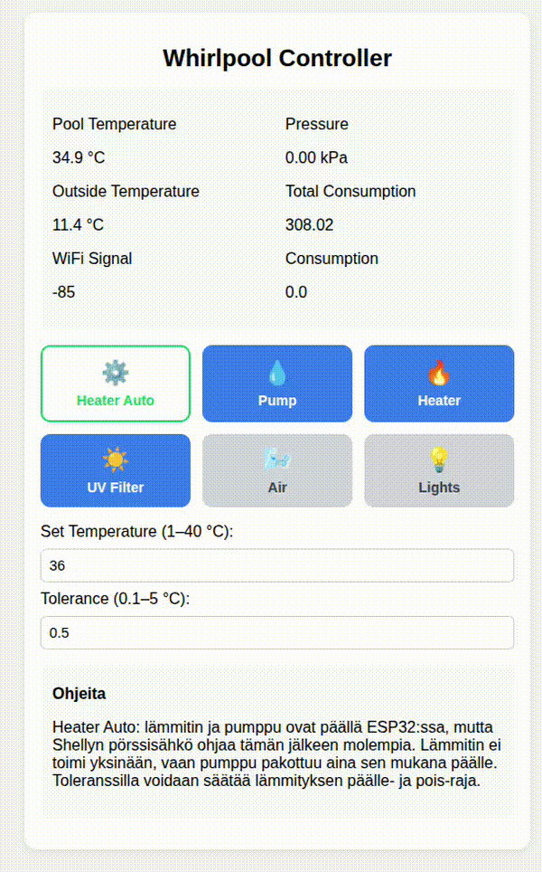

# ESP32 Whirlpool Control System

A comprehensive IoT control system for managing a whirlpool/hot tub using ESP32, featuring web-based control, temperature monitoring, energy tracking, and automated control logic.



## Features

- **Web-based Control Interface**: Real-time control via WebSocket communication
- **Temperature Monitoring**: Dual DS18B20 sensors for pool and outside temperature
- **Pressure Monitoring**: Analog pressure sensor with kPa conversion
- **Energy Monitoring**: Integration with Shelly Plug Plus PM for power consumption tracking
- **Automated Control Logic**: Smart automation based on temperature, time, and external signals
- **OTA Updates**: Over-the-air firmware updates via ElegantOTA
- **Persistent Settings**: Configuration saved to ESP32 NVS (Non-Volatile Storage)
- **WiFi Reconnection**: Automatic WiFi reconnection handling

## Hardware Components

### Controlled Devices (Relays)
- **Pump** (GPIO 13): 100W circulation pump
- **Heater** (GPIO 12): 2kW heating element
- **UV Filter** (GPIO 26): UV-C sterilization system
- **Air Blower** (GPIO 14): Air circulation system
- **Lights** (GPIO 27): Pool lighting
- **Reserve** (GPIO 25): Additional relay for future use

### Sensors
- **Pool Temperature** (GPIO 33): DS18B20 OneWire sensor
- **Outside Temperature** (GPIO 33): DS18B20 OneWire sensor
- **Pressure Sensor** (GPIO 34): 0-5 PSI analog sensor
- **Auto Heater Input** (GPIO 32): External automation signal (Shelly contact)

### External Integration
- **Shelly Plug Plus PM**: Energy monitoring at IP 192.168.1.238

## Software Architecture

### Core Components
1. **AsyncWebServer**: Serves web interface and handles HTTP requests
2. **WebSocket**: Real-time bidirectional communication with web clients
3. **Control Logic**: Automated decision making based on sensor inputs
4. **Persistent Storage**: Settings saved using ESP32 Preferences library
5. **OTA Updates**: ElegantOTA for remote firmware updates

### Control Logic
- **Temperature Control**: Maintains pool temperature within set tolerance
- **Energy-Aware Operation**: Integration with Shelly for power monitoring
- **Manual Override**: User can override automation for individual components
- **Safety Interlocks**: Pump automatically runs when heater or UV filter is active

## Installation

### Prerequisites
- [PlatformIO](https://platformio.org/) installed in VS Code
- ESP32-WROOM-32D development board
- Required hardware components as listed above

### Dependencies
Add these libraries to your `platformio.ini`:

```ini
[env:esp32dev]
platform = espressif32
board = esp32dev
framework = arduino
lib_deps = 
    ottowinter/AsyncTCP-esphome@^1.2.2
    https://github.com/me-no-dev/ESPAsyncWebServer.git
    bblanchon/ArduinoJson@^7.0.0
    paulstoffregen/OneWire@^2.3.8
    milesburton/DallasTemperature@^3.11.0
    ayushsharma82/ElegantOTA@^3.1.0
monitor_speed = 115200
```

### Network Configuration
Update the following in `main.cpp`:

```cpp
// WiFi Credentials
const char* ssid = "YOUR_WIFI_SSID";
const char* password = "YOUR_WIFI_PASSWORD";

// Static IP Configuration
const IPAddress local_IP(192, 168, 1, 237);  // Change to your desired IP
const IPAddress subnet(255, 255, 255, 0);
const IPAddress gateway(192, 168, 1, 1);     // Your router IP

// Shelly Device IP
const char* shellyIP = "192.168.1.238";      // Your Shelly device IP
```

### Hardware Setup
1. Connect relays to GPIO pins as defined in the pin configuration
2. Connect DS18B20 temperature sensors to GPIO 33 (OneWire bus)
3. Connect pressure sensor to GPIO 34 (ADC input)
4. Connect external automation signal to GPIO 32 with pullup
5. Ensure proper power supply for relays and ESP32

### Web Interface
Create the following files in the `data/` folder:
- `index.html`: Main web interface
- `style.css`: Styling (if separate)
- `script.js`: Client-side JavaScript (if separate)

Upload the filesystem using PlatformIO's "Upload Filesystem Image" command.

## Usage

### Initial Setup
1. Flash the firmware to ESP32
2. Upload the filesystem image (SPIFFS)
3. Connect to the device's IP address via web browser
4. Configure temperature setpoints and automation preferences

### Web Interface
Access the control panel at: `http://192.168.1.237` (or your configured IP)

Features available:
- Real-time temperature display
- Manual control switches for all devices
- Temperature setpoint adjustment
- Automation enable/disable
- Energy consumption monitoring
- System status indicators

### API Endpoints
- `GET /`: Main web interface
- `GET /energy`: JSON energy data from Shelly
- `WebSocket /ws`: Real-time control and status updates

### WebSocket Commands
Send JSON commands to `/ws`:

```json
// Toggle pump
{"param": "pump", "value": true}

// Set temperature
{"param": "setTemp", "value": 40.0}

// Enable automation
{"param": "heater_auto", "value": true}
```

## Configuration

### Temperature Settings
- **Set Temperature**: Target pool temperature (°C)
- **Temperature Tolerance**: Hysteresis for heating control (°C)

### Automation Modes
- **Manual Mode**: All devices controlled manually
- **Auto Mode**: Intelligent control based on temperature and external signals
- **Mixed Mode**: Some devices auto, others manual

### Sensor Addresses
DS18B20 sensor addresses are hardcoded. Use the OneWire search code (commented out in loop()) to find your sensor addresses:

```cpp
uint8_t outsideSensorAddress[8] = {0x28, 0xFF, 0x47, 0x4E, 0x78, 0x04, 0x00, 0xF4};
uint8_t poolSensorAddress[8] = {0x28, 0x79, 0x79, 0x46, 0xD4, 0x33, 0x28, 0x79};
```

## Troubleshooting

### Common Issues
1. **WiFi Connection Failed**: Check credentials and signal strength
2. **Temperature Reading -127°C**: Sensor disconnected or wrong address
3. **WebSocket Not Connecting**: Check firewall and network settings
4. **OTA Update Failed**: Ensure stable WiFi connection

### Debug Information
Enable serial output at 115200 baud for debugging information including:
- WiFi connection status
- Sensor readings
- WebSocket events
- HTTP requests

## Safety Considerations

- **Electrical Safety**: Ensure proper isolation between low-voltage control and high-voltage loads
- **Water Protection**: Use appropriate IP-rated enclosures for outdoor installation
- **Temperature Limits**: Implement software and hardware temperature limits
- **Emergency Stop**: Consider adding emergency stop functionality

## License

This project is provided as-is for educational and personal use.

## Contributing

Feel free to submit issues and enhancement requests!

## Changelog

### v1.0
- Initial release with basic control functionality
- WebSocket-based real-time control
- Temperature and pressure monitoring
- Shelly energy integration
- OTA update capability
